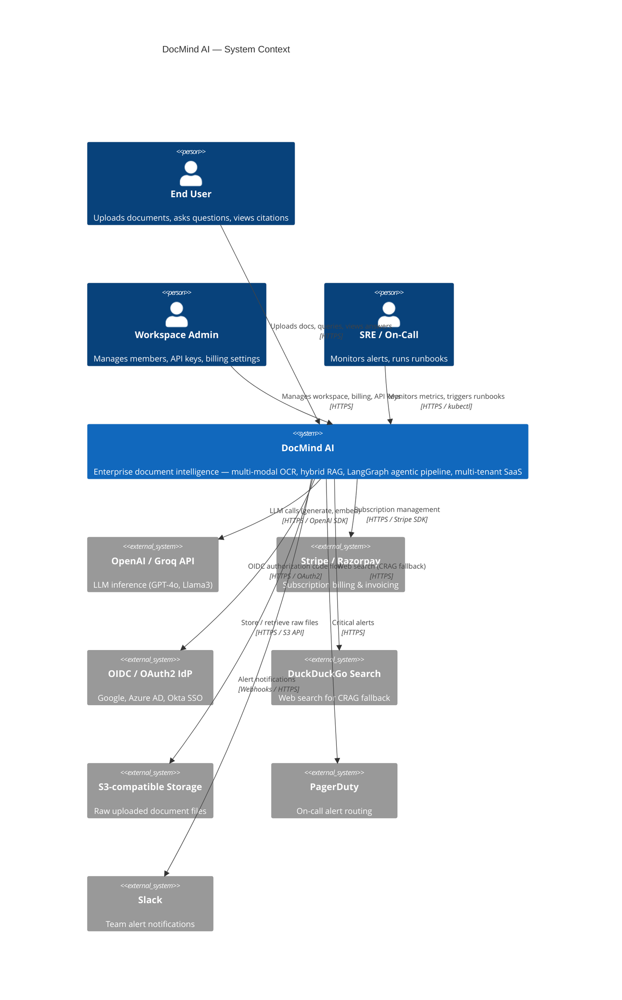
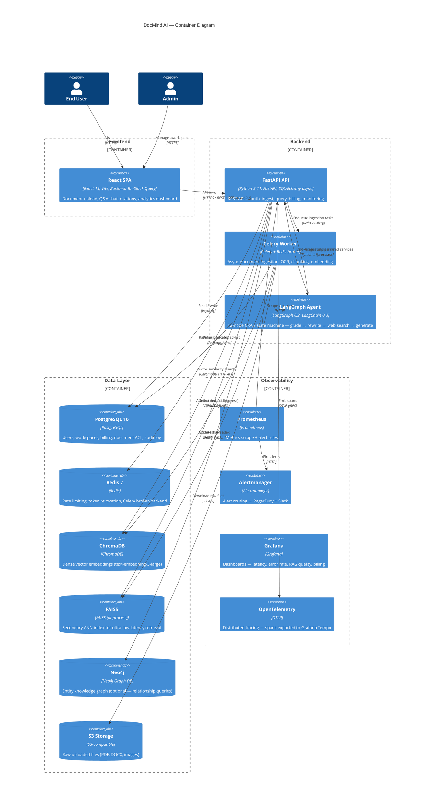

# DocMind AI — System Architecture

## C4 Model Overview

The diagrams below follow the [C4 model](https://c4model.com/): Context → Containers → Components.

---

## Level 1: System Context

---

## Level 2: Container Diagram

---

## Level 3: Component Diagram — API (FastAPI)

```mermaid
C4Component
  title DocMind AI — API Backend Components

  Container_Boundary(api_container, "FastAPI API") {

    Component(auth, "Auth Router\n/api/v1/auth", "FastAPI Router", "Login, register, OAuth2/SSO, MFA/TOTP, token refresh, logout")
    Component(mfa, "MFA Router\n/api/v1/mfa", "FastAPI Router", "TOTP setup, verify, disable — pyotp-based")
    Component(ingest, "Ingest Router\n/api/v1/ingest", "FastAPI Router", "File upload → Celery task → OCR → chunk → embed")
    Component(query, "Query Router\n/api/v1/query", "FastAPI Router", "Streaming RAG endpoint — SSE token-by-token delivery")
    Component(documents, "Documents Router\n/api/v1/documents", "FastAPI Router", "CRUD, listing, pagination, metadata")
    Component(billing, "Billing Router\n/api/v1/billing", "FastAPI Router", "Stripe + Razorpay subscription management")
    Component(monitoring, "Monitoring Router\n/api/v1/monitoring", "FastAPI Router", "Prometheus metrics, system health, usage stats")

    Component(jwt, "JWT Handler", "Python module", "RS256 (production) / HS256 (dev), JTI revocation, SSO state tokens")
    Component(rag, "AdvancedRAGChain", "Python class", "HyDE → hybrid search → rerank → LLM generate, circuit breaker")
    Component(hybrid, "HybridSearcher", "Python class", "ChromaDB + FAISS + BM25/Okapi RRF fusion, JSON cache (no pickle)")
    Component(crag, "CRAG Pipeline", "LangGraph", "Grade → decompose → web search → self-RAG → generate")
    Component(llm_pool, "LLM Pool", "Python module", "get_llm() — OpenAI / Groq / Ollama, FakeListChatModel blocked in prod")
    Component(circuit, "Circuit Breaker", "Python class", "Protects LLM + embedding calls, CLOSED/OPEN/HALF_OPEN FSM")
    Component(rate, "Rate Limiter", "Middleware", "Redis Lua sliding window, fail-closed in prod, Prometheus counter")
    Component(acl, "Document ACL", "Python module", "Per-document permission grants, workspace-role fallback")
    Component(apikey_mw, "ApiKeyAuthMiddleware", "FastAPI Middleware", "Authorization: ApiKey header only (query param disabled)")
  }

  Rel(auth, jwt, "Signs / verifies tokens")
  Rel(query, rag, "Invokes retrieval pipeline")
  Rel(rag, hybrid, "Hybrid BM25 + vector search")
  Rel(rag, llm_pool, "Requests LLM instance")
  Rel(rag, circuit, "Wraps LLM + embedding calls")
  Rel(rag, crag, "CRAG routing when relevance low")
  Rel(query, acl, "Filters results by document ACL")
  Rel(apikey_mw, rate, "Feeds workspace ID for rate limiting")
```

---

## Key Architectural Decisions

| Decision | Choice | Rationale |
|----------|--------|-----------|
| JWT algorithm | RS256 (prod), HS256 (dev) | Asymmetric — private key stays in auth service; downstream services verify with public key |
| BM25 cache | JSON (not pickle) | Pickle can execute arbitrary code on deserialization (RCE) — JSON is data-only |
| API key transport | `X-API-Key` header only | Query params are logged by every HTTP layer; headers are not |
| Rate limiter failure mode | Fail-closed in production | Redis outage must not disable security controls |
| LLM fallback | Hard error in production | Silent fake responses would corrupt user trust; fail fast is correct |
| Citation types | `Citation` (document) vs `WebCitation` (web) | Web results have no page/PDF anchors — separate type prevents broken UI highlights |
| Circuit breaker | Module-level, 5-failure threshold, 60 s reset | Prevent cascading failures on partial OpenAI outages |
| MFA | TOTP via pyotp | RFC 6238 standard, compatible with all authenticator apps, no SMS dependency |
| Document ACL | Per-file permission table with workspace-level fallback | Minimal configuration overhead while supporting fine-grained sharing |
